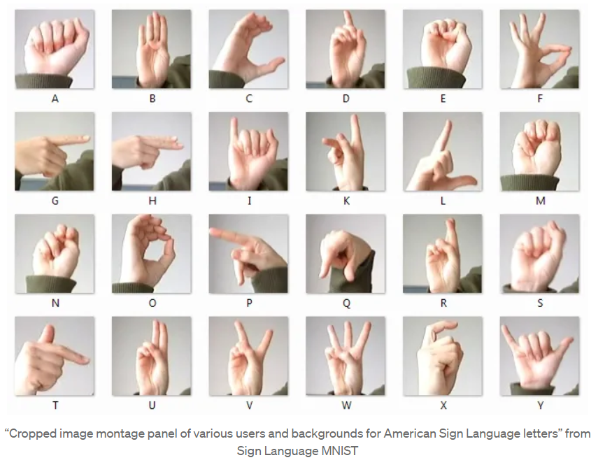
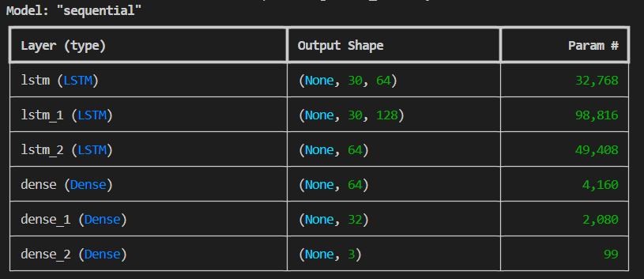

# Sign Language Detection Using Machine Learning:-



This repository contains code for detecting and recognizing sign language gestures using machine learning techniques. The goal of this project is to create a system that can interpret sign language gestures captured through video or image input.


## Introduction:-

```bash

Sign language is a vital means of communication for people with hearing impairments. This project aims to leverage machine learning algorithms to automatically interpret sign language gestures. By training models on a dataset of sign language gestures, the system can recognize and translate these gestures into text or speech.
```


## Dependencies:-

```bash

Python 3.11
NumPy
OpenCV
Scikit-learn
TensorFlow
Keras

```

## Installation:-

### 1.Clone this repository:-


```bash

git clone https://github.com/Abhishek4209/Sign-Language-detection

```
### 2.Install the required dependencies using pip:-

```bash
pip install -r requirements.txt

```


## Usage:-

* Prepare your dataset of sign language gestures. Ensure that each gesture is labeled with the corresponding sign.

* 1) Gather the data for training by executing following command - "python collectdata.py" , webcam window will open , in blue window make appropriate sign and then press character associated with it on keyboard 
this will record image , number of key presses = number of images recorded :-

```bash

python collectdata.py

```

* 2) Then run "python data.py" to convert images to numpy array:-

```bash
python data.py
```

* 3) Then run "python trainmodel.py" to train the model on numpy array :-

```bash
python trainmodel.py
```

* 4) At last execute "python app.py" , then a webcam window will open and in which you can show the sign and get prediction by model

```bash
python app.py
```

## Model architecture:-




## Contributing:-

Contributions are welcome! If you'd like to contribute to this project, please fork the repository and submit a pull request with your changes. For major changes, please open an issue first to discuss the proposed changes.


## License:-

This project is licensed under the MIT License - see the LICENSE file for details.